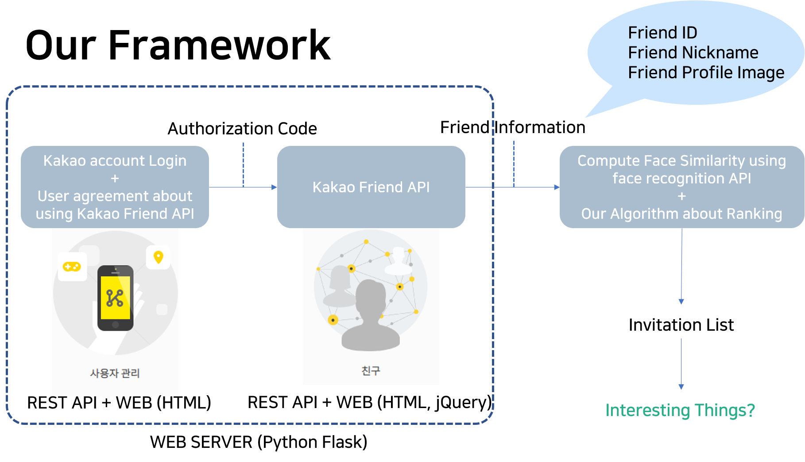

# pichat

2019-1 창의융합캡스톤디자인 AimHigh 팀 프로젝트
- 사진으로 간편한 단체 채팅방(서비스) 만들기

## Framework
- 전체 구조


- 얼굴 인식파트 구조


## Reference
* face_recognition API by @ageitgey
(https://github.com/ageitgey/face_recognition)

* Kakao Friend API
(https://developers.kakao.com/features/platform#%EC%B9%9C%EA%B5%AC-API)

## 팀원 (Contact)
```python
현지웅 (조장) : 성균관대학교 소프트웨어학과 16학번 (kabbi159@gmail.com)
박태현 (조원) : 성균관대학교 소프트웨어학과 18학번
배수영 (조원) : 성균관대학교 소프트웨어학과 18학번
이산하 (조원) : 성균관대학교 소프트웨어학과 18학번
```
